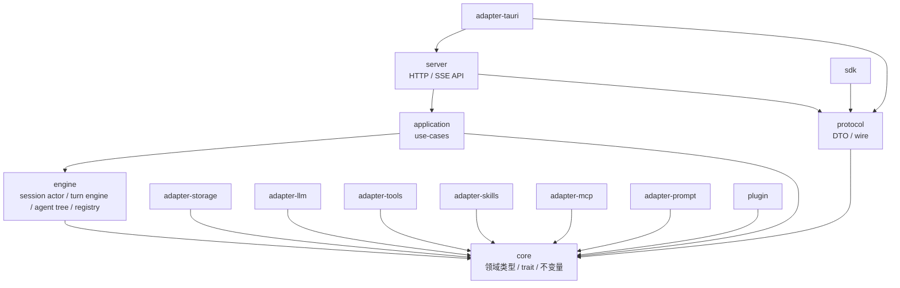
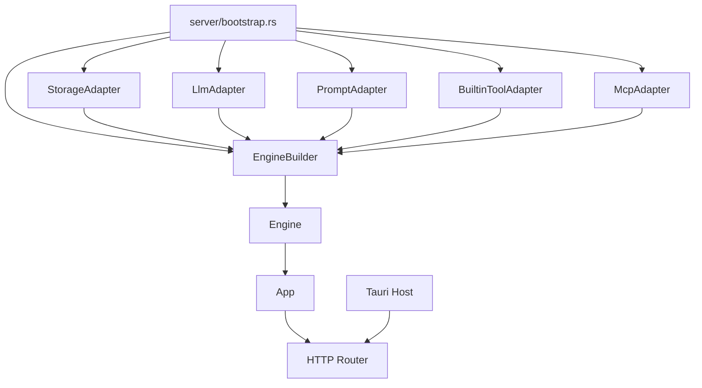
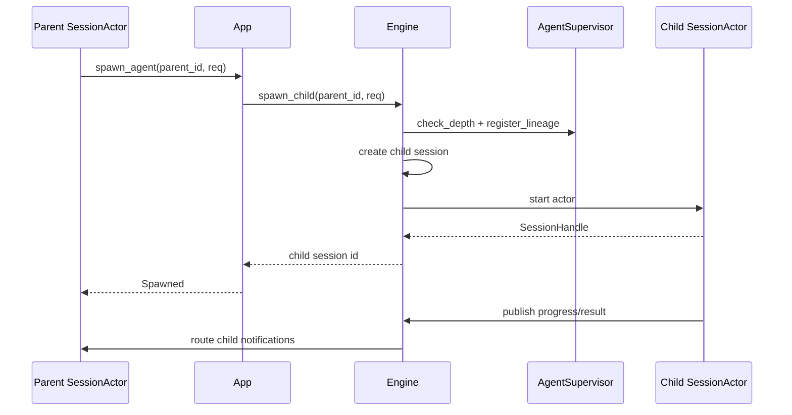
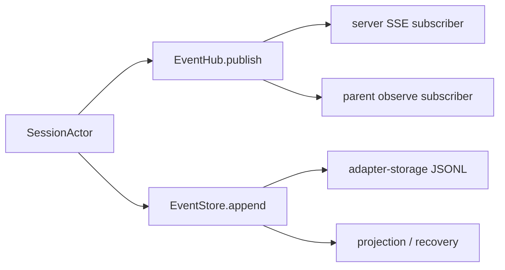

````md
# Astrcode 最终架构设计（Server 作为稳定边界版）

> 目标：  
> - 保留 `server`，实现真正的前后端分离  
> - 前端可自由替换（Web / Tauri WebView / Electron / CLI / 移动端）  
> - 删除 `runtime` 这个高腐化风险概念  
> - 采用 **`core + engine + application + server + adapters + protocol`**  
>
> 这个版本延续了你现有文档里最有价值的约束：  
> - `Server Is The Truth`，Tauri 只是宿主，业务统一走 HTTP/SSE。:contentReference[oaicite:0]{index=0}  
> - `application` 不应依赖任何 `adapter-*`。:contentReference[oaicite:1]{index=1}  
> - session 执行应采用 Actor 模型，且不直接持有 provider。  
> - `runtime` 一坨应被拆散为职责明确的层。:contentReference[oaicite:3]{index=3}

---

## 一、最终一句话结论

把现有 `runtime` 拆掉，重组为：

- `core`：领域类型 + 稳定端口契约
- `engine`：运行时内核（session actor + turn engine + agent tree + capability registry）
- `application`：薄用例层
- `server`：唯一对外业务边界（HTTP/SSE）
- `adapter-*`：所有具体实现
- `protocol`：对外 DTO / wire

---

## 二、最终 crate 结构

```text
crates/
├── core/               # 领域类型、事件、端口 trait、不变量
├── protocol/           # 对外 DTO / wire（依赖 core）
├── engine/             # 运行内核：session actor + registry + agent tree + turn engine
├── application/        # 薄用例层：稳定入口
├── server/             # HTTP/SSE API，前后端分离边界
│
├── adapter-storage/    # JSONL / snapshot / projection / recovery
├── adapter-llm/        # LLM provider
├── adapter-tools/      # builtin tools + agent tools
├── adapter-skills/     # skills 发现 / 解析
├── adapter-mcp/        # MCP transport + manager + bridge
├── adapter-prompt/     # prompt builder
├── adapter-tauri/      # 桌面宿主（启动 server）
│
├── plugin/             # 宿主侧插件管理
└── sdk/                # 插件开发 SDK
````

---

## 三、顶层依赖关系图



---

## 四、硬依赖规则

### 允许

* `protocol -> core`
* `engine -> core`
* `application -> engine + core`
* `server -> application + protocol`
* `adapter-* -> core`
* `adapter-tauri -> server + protocol`

### 禁止

* `application -> adapter-*`
* `engine -> adapter-*`
* `server -> engine`
* handler 直接绕过 `application` 调 `engine`
* 前端直接碰 `engine`
* `core -> protocol`

---

## 五、各层职责

---

### 1. `core`

#### 职责

* 定义领域类型
* 定义稳定 trait 端口
* 定义事件、错误、不变量
* 不包含具体实现

#### 放什么

* `SessionId / TurnId / AgentId`
* `TurnInput / SpawnAgentRequest / ToolResult / AgentEvent`
* `ToolProvider / LlmProvider / PromptProvider / ResourceProvider`
* `EventStore / ApprovalStore / Clock / IdGenerator`

#### 不放什么

* JSONL
* HTTP
* MCP 协议
* 前端展示字段
* 宿主配置
* 产品策略实现

#### 示例

```rust
pub trait ToolProvider: Send + Sync {
    fn tool_descriptors(&self) -> Vec<ToolDescriptor>;
    async fn invoke_tool(&self, name: &str, input: serde_json::Value) -> Result<ToolResult>;
}

pub trait LlmProvider: Send + Sync {
    async fn complete(&self, req: LlmRequest) -> Result<LlmStream>;
}

pub trait PromptProvider: Send + Sync {
    async fn build(&self, ctx: PromptContext) -> Result<BuiltPrompt>;
}

pub trait ResourceProvider: Send + Sync {
    async fn list(&self) -> Result<Vec<ResourceDescriptor>>;
    async fn read(&self, uri: &str) -> Result<ResourceContent>;
}

pub trait EventStore: Send + Sync {
    async fn append(&self, session_id: SessionId, events: &[AgentEvent]) -> Result<AppendAck>;
    async fn load_session(&self, session_id: SessionId) -> Result<Vec<StoredEvent>>;
}

pub trait ApprovalStore: Send + Sync {
    async fn get_status(&self, server_id: &str) -> Result<ApprovalStatus>;
    async fn set_status(&self, server_id: &str, status: ApprovalStatus) -> Result<()>;
}
```

---

### 2. `engine`

#### 职责

运行时真相层，只负责系统运行语义：

* capability registry
* session actor 生命周期
* session directory
* turn execution loop
* agent tree / 子 agent 谱系
* cancel / observe / recovery
* event hub
* 通过 `EventStore` 端口做 durable append

#### 不做

* HTTP 语义
* DTO 映射
* 配置文件读取
* MCP 审批文件读写
* Tauri 宿主逻辑
* handler 层错误映射

#### 内部模块建议

```text
engine/
├── lib.rs
├── builder.rs
├── registry/
├── session/
├── turn/
├── agent_tree/
├── recovery/
└── events/
```

#### 核心结构

```rust
pub struct Engine {
    registries: CapabilityRegistries,
    sessions: SessionDirectory,
    agents: AgentSupervisor,
    event_store: Arc<dyn EventStore>,
    event_hub: EventHub,
    clock: Arc<dyn Clock>,
    id_gen: Arc<dyn IdGenerator>,
}
```

---

### 3. `application`

#### 职责

对外稳定用例层：

* 参数校验
* 权限/用例级约束
* 调用 `engine`
* 返回稳定结果给 `server`

#### 不做

* provider 注册
* llm/prompt/mcp/storage 细节
* 具体 adapter 类型处理

#### 模块建议

```text
application/
├── lib.rs
├── app.rs
├── session.rs
├── agent.rs
├── query.rs
└── errors.rs
```

#### API 示例

```rust
pub struct App {
    engine: Arc<Engine>,
}

impl App {
    pub async fn create_session(&self, req: CreateSessionRequest) -> Result<SessionId>;
    pub async fn run_turn(&self, session_id: SessionId, input: TurnInput) -> Result<TurnStream>;
    pub async fn cancel_turn(&self, session_id: SessionId, turn_id: TurnId) -> Result<()>;
    pub async fn observe_session(&self, session_id: SessionId) -> Result<AgentEventStream>;
    pub async fn spawn_agent(&self, parent: SessionId, req: SpawnAgentRequest) -> Result<SessionId>;
    pub async fn close_session(&self, session_id: SessionId) -> Result<()>;
}
```

---

### 4. `server`

#### 职责

它不是普通 adapter，而是**正式产品边界**：

* HTTP 路由
* SSE 事件输出
* `protocol` DTO ↔ `application` 映射
* auth / api error / pagination / transport concern
* 对所有前端提供稳定协议面

#### 保留它的原因

因为你要的是：

* 前后端分离
* 前端可自由替换
* Tauri 只是宿主
* Web 前端也能独立跑

这和你现有文档里的 “Server Is The Truth” 完全一致。

#### 不做

* 业务状态真相
* capability 注册
* 内核级调度
* 具体 adapter 逻辑

---

### 5. `adapter-storage`

#### 职责

* 实现 `EventStore`
* JSONL 持久化
* snapshot / projection
* recovery 读路径

#### 说明

你现有方案里提到“事件可通过 channel 发出，再由 storage 订阅落盘”。
更稳的版本是：

> 广播可以走 `EventHub`，但 durability 必须通过 `EventStore.append()` 显式进入主路径。

---

### 6. `adapter-llm`

#### 职责

* 实现 `LlmProvider`
* 模型提供者适配
* token / stream / provider error 统一

---

### 7. `adapter-tools`

#### 职责

* 内置工具
* agent 协作工具
* 统一实现 `ToolProvider`

#### 目录建议

```text
adapter-tools/
├── builtin/
│   ├── read_file.rs
│   ├── write_file.rs
│   ├── shell.rs
│   └── grep.rs
└── agent/
    ├── spawn.rs
    ├── send.rs
    ├── observe.rs
    └── close.rs
```

这和你现有重构稿里把 `runtime-tool-loader + runtime-agent-tool` 合并为 `adapter-tools` 的方向一致。

---

### 8. `adapter-skills`

#### 职责

* skill frontmatter 扫描
* skill 索引
* 按需加载

---

### 9. `adapter-mcp`

#### 职责

* MCP transport
* JSON-RPC client
* manager / reconnect / hot reload
* bridge 到 `ToolProvider / PromptProvider / ResourceProvider`

#### 目录建议

```text
adapter-mcp/
├── transport/
├── protocol/
├── manager/
├── config/
└── bridge/
```

#### 必修 bug

你的文档里已经指出：

* `in_flight_count` 定义了但未在调用时 begin/end；
* 热加载移除服务器时未调用 cancel/force disconnect。

这两个应直接修。

---

### 10. `adapter-tauri`

#### 职责

* 宿主进程
* 启动/停止 `server`
* 窗口管理
* 本地桌面能力

#### 不做

* 业务真相
* 内核调用
* 直接消费 engine 事件

---

## 六、核心交互图

---

### 1. 启动与组合根



---

### 2. 单次 turn 流程

```mermaid
sequenceDiagram
    participant Client
    participant Server
    participant App
    participant Engine
    participant Actor as SessionActor
    participant Prompt
    participant LLM
    participant Tools
    participant Store
    participant SSE

    Client->>Server: POST /sessions/:id/turns
    Server->>App: run_turn(session_id, input)
    App->>Engine: get_session(session_id)
    App->>Actor: RunTurn(input)

    Actor->>Store: append(TurnStarted)
    Actor->>SSE: publish(TurnStarted)

    Actor->>Engine: build_prompt(ctx)
    Engine->>Prompt: build(ctx)
    Prompt-->>Engine: BuiltPrompt
    Engine-->>Actor: BuiltPrompt

    Actor->>Store: append(ThinkingStarted)
    Actor->>SSE: publish(ThinkingStarted)

    Actor->>Engine: call_llm(req)
    Engine->>LLM: complete(req)

    loop until no tool call
        LLM-->>Actor: stream delta / tool call
        Actor->>SSE: publish(delta / toolcall)
        Actor->>Store: append(delta / toolcall)

        Actor->>Engine: invoke_tool(name, input)
        Engine->>Tools: invoke_tool
        Tools-->>Engine: ToolResult
        Engine-->>Actor: ToolResult

        Actor->>Store: append(ToolResult)
        Actor->>SSE: publish(ToolResult)
    end

    Actor->>Store: append(TurnFinished)
    Actor->>SSE: publish(TurnFinished)

    Actor-->>App: TurnStream
    App-->>Server: TurnStream
    Server-->>Client: stream response
```

---

### 3. 子 agent 流程



---

### 4. 事件与持久化



---

## 七、文件级职责建议

---

### `core/lib.rs`

暴露：

* 领域类型
* trait
* errors
* ids
* events

不暴露：

* 任何实现 helper

---

### `engine/lib.rs`

只暴露：

* `Engine`
* `EngineBuilder`
* `SessionHandle`
* `AgentEventStream`

不暴露：

* registry 内部 map
* actor mailbox 细节
* 内部模块 struct

---

### `application/lib.rs`

只暴露：

* `App`
* 请求/响应入口类型
* application errors

---

### `server/lib.rs`

只暴露：

* `build_router(app: Arc<App>)`
* `bootstrap(config) -> ServerHandle`

---

## 八、硬规则

### `core`

* 不出现具体实现
* 不出现文件路径
* 不出现 HTTP/MCP/Tauri 细节

### `engine`

* 不 `use adapter_*`
* 不出现 DTO 映射
* 不读取宿主配置
* 不直接触碰 UI 语义
* 不对外暴露内部 registry 容器

### `application`

* 不 `use adapter_*`
* 不写 provider 实现逻辑
* 不做 storage/llm/mcp/prompt 细节

### `server`

* 不绕过 `application`
* 不直接使用 `engine` 内部模块类型
* 只做 transport concern

### `adapter-*`

* 只实现 `core` 端口
* 不反向依赖 `engine` 和 `application`

---

## 九、腐化预警

出现以下任一信号，立刻停下检查：

* `use adapter_*` 出现在 `engine/` 或 `application/`
* `server` 直接调用 `engine` 内部模块，而不是 `application`
* `SessionActor` 直接持有具体 provider 对象集合
* `engine` 暴露 `DashMap` / registry 内部结构给外部
* `adapter-mcp` 直接修改 `engine` 内部字段，而不是走公开 API
* `application` 开始写 prompt/llm/mcp/storage 细节
* 某个 crate 单文件超过 800 行并持续增长

---

## 十、迁移顺序

1. 改名：`runtime-*` 中明显实现层的 crate 先改成 `adapter-*`
2. 修 `adapter-mcp` 两个已知 bug
3. 抽 `engine`

   * 合并 `runtime-registry`
   * 合并 `runtime-agent-control`
   * 合并 `runtime-agent-loop`
   * 合并 `runtime-execution`
   * 合并 `runtime-session`
4. 抽 `application`

   * 从旧 `runtime` 提取门面方法
5. 保留并收紧 `server`

   * 所有 handler 只调 `application`
6. 最后删除 `runtime`

