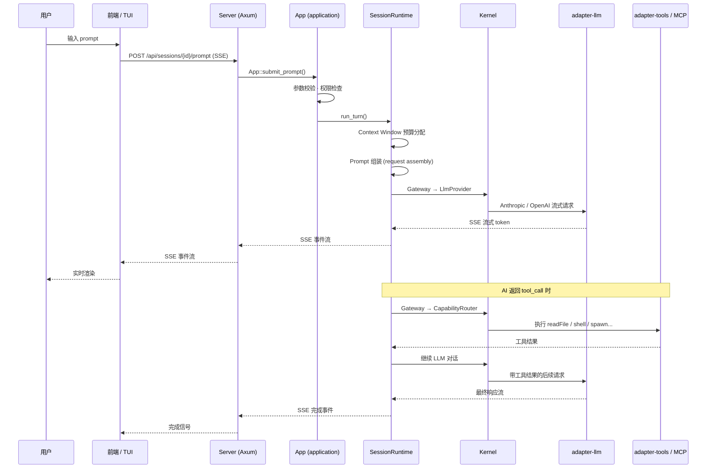
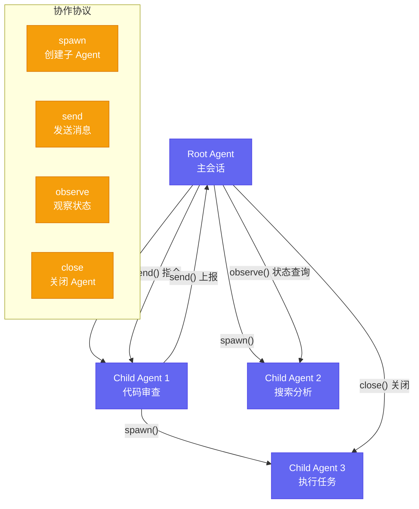
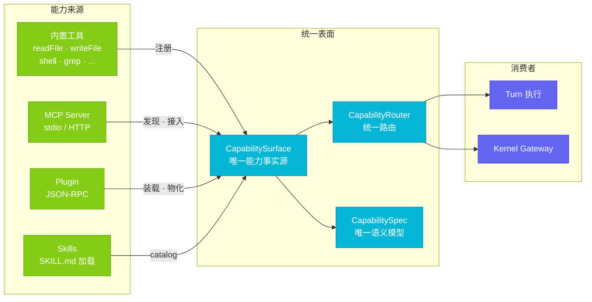

# AstrCode 架构图

## 系统分层与依赖关系

```mermaid
graph TB
    subgraph 客户端["🖥️ 客户端 (Conversation Surface)"]
        FE["React 前端<br/>(Vite + Tailwind)"]
        CLI["TUI 终端<br/>(ratatui)"]
    end

    subgraph 传输层["📡 传输层"]
        TAURI["Tauri 2 桌面壳"]
        SVR["Server<br/>(Axum HTTP/SSE)"]
        PROTO["Protocol<br/>DTO & Wire Types"]
    end

    subgraph 组合根["🔧 组合根 (bootstrap)"]
        BOOT["bootstrap/runtime.rs<br/>唯一装配入口"]
    end

    subgraph 应用层["📋 应用层"]
        APP["App<br/>用例编排 · 参数校验 · 权限策略"]
        GOV["AppGovernance<br/>治理 · 重载 · 观测"]
        OBS["RuntimeObservabilityCollector"]
    end

    subgraph 会话层["🔄 会话运行时"]
        SR["SessionRuntime<br/>单会话真相面"]
        ACTOR["SessionActor<br/>live truth · 推进"]
        TURN["Turn 状态机<br/>LLM → Tool → Compact"]
        CTX["Context Window<br/>预算分配 · 裁剪 · 压缩"]
        MAIL["Mailbox / Delivery<br/>子 Agent 消息契约"]
        QUERY["Query / Command<br/>读写分离"]
    end

    subgraph 控制面["🎛️ 全局控制面"]
        KERN["Kernel"]
        ROUTER["Capability Router<br/>统一能力路由"]
        REG["Registry<br/>Tool / LLM / Prompt"]
        TREE["Agent Tree<br/>全局控制合同"]
    end

    subgraph 领域层["💎 领域核心"]
        CORE["Core"]
        ID["强类型 ID"]
        EVENT["领域事件 · EventLog"]
        PORT["端口契约<br/>LlmProvider · PromptProvider<br/>EventStore · ResourceProvider"]
        CAP["CapabilitySpec<br/>唯一能力语义模型"]
        CFG["稳定配置模型"]
    end

    subgraph 适配器层["🔌 适配器层 (端口实现)"]
        A_LLM["adapter-llm<br/>Anthropic · OpenAI"]
        A_STORE["adapter-storage<br/>JSONL 事件日志"]
        A_PROMPT["adapter-prompt<br/>Prompt 模板加载"]
        A_TOOLS["adapter-tools<br/>内置工具定义"]
        A_SKILLS["adapter-skills<br/>Skill 加载与物化"]
        A_MCP["adapter-mcp<br/>MCP 协议传输"]
        A_AGENTS["adapter-agents<br/>Agent 定义加载"]
    end

    subgraph 扩展层["🧩 扩展层"]
        PLUGIN["Plugin<br/>插件模型 · 宿主基础设施"]
        SDK["SDK<br/>Rust 插件开发包"]
        MCP_EXT["外部 MCP Server"]
    end

    %% 客户端 → 传输层
    FE -->|"HTTP/SSE"| SVR
    FE -.->|"Tauri IPC"| TAURI
    CLI -->|"HTTP/SSE"| SVR
    TAURI --> SVR

    %% 传输层 → 组合根/应用层
    SVR -->|"handler 薄委托"| APP
    SVR --> PROTO
    PROTO -->|"DTO ↔ 领域转换"| CORE

    %% 组合根
    BOOT -.->|"装配"| APP
    BOOT -.->|"装配"| GOV
    BOOT -.->|"装配"| KERN
    BOOT -.->|"装配"| SR
    BOOT -.->|"注入实现"| A_LLM
    BOOT -.->|"注入实现"| A_STORE
    BOOT -.->|"注入实现"| A_PROMPT
    BOOT -.->|"注入实现"| A_TOOLS
    BOOT -.->|"注入实现"| A_SKILLS
    BOOT -.->|"注入实现"| A_MCP
    BOOT -.->|"注入实现"| A_AGENTS
    BOOT -.->|"装载"| PLUGIN

    %% 应用层 → 会话/控制面
    APP -->|"用例调用"| SR
    APP -->|"治理策略"| KERN
    GOV -->|"reload 编排"| APP

    %% 会话层内部
    SR --> ACTOR
    SR --> TURN
    SR --> CTX
    SR --> MAIL
    SR --> QUERY
    SR -->|"经由 gateway"| KERN

    %% 控制面 → 领域
    KERN --> ROUTER
    KERN --> REG
    KERN --> TREE
    KERN --> CORE

    %% 领域内部
    CORE --> ID
    CORE --> EVENT
    CORE --> PORT
    CORE --> CAP
    CORE --> CFG

    %% 适配器实现端口
    A_LLM -.->|"impl LlmProvider"| PORT
    A_STORE -.->|"impl EventStore"| PORT
    A_PROMPT -.->|"impl PromptProvider"| PORT
    A_TOOLS -.->|"capability 桥接"| CAP
    A_MCP -.->|"MCP → CapabilitySurface"| CAP
    A_AGENTS -.->|"Agent 定义加载"| CORE
    A_SKILLS -.->|"Skill 物化"| CORE

    %% 扩展
    PLUGIN --> SDK
    A_MCP -->|"stdio / HTTP / SSE"| MCP_EXT

    %% 样式
    classDef client fill:#6366f1,stroke:#4f46e5,color:#fff
    classDef transport fill:#8b5cf6,stroke:#7c3aed,color:#fff
    classDef bootstrap fill:#f59e0b,stroke:#d97706,color:#fff
    classDef app fill:#10b981,stroke:#059669,color:#fff
    classDef session fill:#3b82f6,stroke:#2563eb,color:#fff
    classDef kernel fill:#06b6d4,stroke:#0891b2,color:#fff
    classDef core fill:#f43f5e,stroke:#e11d48,color:#fff
    classDef adapter fill:#84cc16,stroke:#65a30d,color:#fff
    classDef extension fill:#a855f7,stroke:#9333ea,color:#fff

    class FE,CLI client
    class SVR,TAURI,PROTO transport
    class BOOT bootstrap
    class APP,GOV,OBS app
    class SR,ACTOR,TURN,CTX,MAIL,QUERY session
    class KERN,ROUTER,REG,TREE kernel
    class CORE,ID,EVENT,PORT,CAP,CFG core
    class A_LLM,A_STORE,A_PROMPT,A_TOOLS,A_SKILLS,A_MCP,A_AGENTS adapter
    class PLUGIN,SDK,MCP_EXT extension
```



## 依赖规则一览

```mermaid
graph LR
    subgraph 允许 ✅
        direction TB
        PROTO2["protocol"] --> CORE2["core"]
        KERN2["kernel"] --> CORE2
        SR2["session-runtime"] --> CORE2
        SR2 --> KERN2
        APP2["application"] --> CORE2
        APP2 --> KERN2
        APP2 --> SR2
        SVR2["server"] --> APP2
        SVR2 --> PROTO2
        ADAPTER2["adapter-*"] --> CORE2
    end

    subgraph 条件允许 ⚠️
        SVR2 -.->|"仅组合根装配"| ADAPTER2
    end

    subgraph 禁止 🚫
        CORE2 x--x|"反向依赖"| PROTO2
        APP2 x--x|"直接依赖"| ADAPTER2
        KERN2 x--x|"直接依赖"| ADAPTER2
    end

    classDef allowed fill:#10b981,stroke:#059669,color:#fff
    classDef conditional fill:#f59e0b,stroke:#d97706,color:#fff
    classDef forbidden fill:#ef4444,stroke:#dc2626,color:#fff

    class PROTO2,CORE2,KERN2,SR2,APP2,SVR2,ADAPTER2 allowed
```

## 数据流：一次用户请求的完整路径



## Agent 协作模型



## 能力统一接入模型


