# Crates Dependency Graph

自动生成文件，请勿手工编辑。

- 生成命令：`node scripts/generate-crate-deps-graph.mjs`

## Mermaid

```mermaid
graph TD
  astrcode-adapter-agents[astrcode-adapter-agents] --> astrcode-core[astrcode-core]
  astrcode-adapter-agents[astrcode-adapter-agents] --> astrcode-support[astrcode-support]
  astrcode-adapter-llm[astrcode-adapter-llm] --> astrcode-core[astrcode-core]
  astrcode-adapter-llm[astrcode-adapter-llm] --> astrcode-governance-contract[astrcode-governance-contract]
  astrcode-adapter-llm[astrcode-adapter-llm] --> astrcode-llm-contract[astrcode-llm-contract]
  astrcode-adapter-llm[astrcode-adapter-llm] --> astrcode-prompt-contract[astrcode-prompt-contract]
  astrcode-adapter-mcp[astrcode-adapter-mcp] --> astrcode-core[astrcode-core]
  astrcode-adapter-mcp[astrcode-adapter-mcp] --> astrcode-plugin-host[astrcode-plugin-host]
  astrcode-adapter-mcp[astrcode-adapter-mcp] --> astrcode-prompt-contract[astrcode-prompt-contract]
  astrcode-adapter-mcp[astrcode-adapter-mcp] --> astrcode-runtime-contract[astrcode-runtime-contract]
  astrcode-adapter-mcp[astrcode-adapter-mcp] --> astrcode-support[astrcode-support]
  astrcode-adapter-prompt[astrcode-adapter-prompt] --> astrcode-core[astrcode-core]
  astrcode-adapter-prompt[astrcode-adapter-prompt] --> astrcode-governance-contract[astrcode-governance-contract]
  astrcode-adapter-prompt[astrcode-adapter-prompt] --> astrcode-host-session[astrcode-host-session]
  astrcode-adapter-prompt[astrcode-adapter-prompt] --> astrcode-prompt-contract[astrcode-prompt-contract]
  astrcode-adapter-prompt[astrcode-adapter-prompt] --> astrcode-support[astrcode-support]
  astrcode-adapter-prompt[astrcode-adapter-prompt] --> astrcode-tool-contract[astrcode-tool-contract]
  astrcode-adapter-skills[astrcode-adapter-skills] --> astrcode-core[astrcode-core]
  astrcode-adapter-skills[astrcode-adapter-skills] --> astrcode-support[astrcode-support]
  astrcode-adapter-storage[astrcode-adapter-storage] --> astrcode-core[astrcode-core]
  astrcode-adapter-storage[astrcode-adapter-storage] --> astrcode-host-session[astrcode-host-session]
  astrcode-adapter-storage[astrcode-adapter-storage] --> astrcode-support[astrcode-support]
  astrcode-adapter-tools[astrcode-adapter-tools] --> astrcode-core[astrcode-core]
  astrcode-adapter-tools[astrcode-adapter-tools] --> astrcode-governance-contract[astrcode-governance-contract]
  astrcode-adapter-tools[astrcode-adapter-tools] --> astrcode-host-session[astrcode-host-session]
  astrcode-adapter-tools[astrcode-adapter-tools] --> astrcode-support[astrcode-support]
  astrcode-adapter-tools[astrcode-adapter-tools] --> astrcode-tool-contract[astrcode-tool-contract]
  astrcode-agent-runtime[astrcode-agent-runtime] --> astrcode-context-window[astrcode-context-window]
  astrcode-agent-runtime[astrcode-agent-runtime] --> astrcode-core[astrcode-core]
  astrcode-agent-runtime[astrcode-agent-runtime] --> astrcode-llm-contract[astrcode-llm-contract]
  astrcode-agent-runtime[astrcode-agent-runtime] --> astrcode-prompt-contract[astrcode-prompt-contract]
  astrcode-agent-runtime[astrcode-agent-runtime] --> astrcode-runtime-contract[astrcode-runtime-contract]
  astrcode-agent-runtime[astrcode-agent-runtime] --> astrcode-tool-contract[astrcode-tool-contract]
  astrcode-cli[astrcode-cli] --> astrcode-client[astrcode-client]
  astrcode-cli[astrcode-cli] --> astrcode-core[astrcode-core]
  astrcode-cli[astrcode-cli] --> astrcode-support[astrcode-support]
  astrcode-client[astrcode-client] --> astrcode-protocol[astrcode-protocol]
  astrcode-context-window[astrcode-context-window] --> astrcode-core[astrcode-core]
  astrcode-context-window[astrcode-context-window] --> astrcode-llm-contract[astrcode-llm-contract]
  astrcode-context-window[astrcode-context-window] --> astrcode-runtime-contract[astrcode-runtime-contract]
  astrcode-context-window[astrcode-context-window] --> astrcode-support[astrcode-support]
  astrcode-context-window[astrcode-context-window] --> astrcode-tool-contract[astrcode-tool-contract]
  astrcode-core[astrcode-core]
  astrcode-eval[astrcode-eval] --> astrcode-core[astrcode-core]
  astrcode-eval[astrcode-eval] --> astrcode-protocol[astrcode-protocol]
  astrcode-eval[astrcode-eval] --> astrcode-support[astrcode-support]
  astrcode-governance-contract[astrcode-governance-contract] --> astrcode-core[astrcode-core]
  astrcode-governance-contract[astrcode-governance-contract] --> astrcode-prompt-contract[astrcode-prompt-contract]
  astrcode-host-session[astrcode-host-session] --> astrcode-agent-runtime[astrcode-agent-runtime]
  astrcode-host-session[astrcode-host-session] --> astrcode-core[astrcode-core]
  astrcode-host-session[astrcode-host-session] --> astrcode-governance-contract[astrcode-governance-contract]
  astrcode-host-session[astrcode-host-session] --> astrcode-plugin-host[astrcode-plugin-host]
  astrcode-host-session[astrcode-host-session] --> astrcode-prompt-contract[astrcode-prompt-contract]
  astrcode-host-session[astrcode-host-session] --> astrcode-runtime-contract[astrcode-runtime-contract]
  astrcode-host-session[astrcode-host-session] --> astrcode-support[astrcode-support]
  astrcode-host-session[astrcode-host-session] --> astrcode-tool-contract[astrcode-tool-contract]
  astrcode-llm-contract[astrcode-llm-contract] --> astrcode-core[astrcode-core]
  astrcode-llm-contract[astrcode-llm-contract] --> astrcode-governance-contract[astrcode-governance-contract]
  astrcode-llm-contract[astrcode-llm-contract] --> astrcode-prompt-contract[astrcode-prompt-contract]
  astrcode-plugin-host[astrcode-plugin-host] --> astrcode-core[astrcode-core]
  astrcode-plugin-host[astrcode-plugin-host] --> astrcode-governance-contract[astrcode-governance-contract]
  astrcode-plugin-host[astrcode-plugin-host] --> astrcode-protocol[astrcode-protocol]
  astrcode-prompt-contract[astrcode-prompt-contract] --> astrcode-core[astrcode-core]
  astrcode-protocol[astrcode-protocol] --> astrcode-core[astrcode-core]
  astrcode-protocol[astrcode-protocol] --> astrcode-governance-contract[astrcode-governance-contract]
  astrcode-runtime-contract[astrcode-runtime-contract] --> astrcode-core[astrcode-core]
  astrcode-runtime-contract[astrcode-runtime-contract] --> astrcode-llm-contract[astrcode-llm-contract]
  astrcode-runtime-contract[astrcode-runtime-contract] --> astrcode-tool-contract[astrcode-tool-contract]
  astrcode-server[astrcode-server] --> astrcode-adapter-agents[astrcode-adapter-agents]
  astrcode-server[astrcode-server] --> astrcode-adapter-llm[astrcode-adapter-llm]
  astrcode-server[astrcode-server] --> astrcode-adapter-mcp[astrcode-adapter-mcp]
  astrcode-server[astrcode-server] --> astrcode-adapter-prompt[astrcode-adapter-prompt]
  astrcode-server[astrcode-server] --> astrcode-adapter-skills[astrcode-adapter-skills]
  astrcode-server[astrcode-server] --> astrcode-adapter-storage[astrcode-adapter-storage]
  astrcode-server[astrcode-server] --> astrcode-adapter-tools[astrcode-adapter-tools]
  astrcode-server[astrcode-server] --> astrcode-agent-runtime[astrcode-agent-runtime]
  astrcode-server[astrcode-server] --> astrcode-context-window[astrcode-context-window]
  astrcode-server[astrcode-server] --> astrcode-core[astrcode-core]
  astrcode-server[astrcode-server] --> astrcode-governance-contract[astrcode-governance-contract]
  astrcode-server[astrcode-server] --> astrcode-host-session[astrcode-host-session]
  astrcode-server[astrcode-server] --> astrcode-llm-contract[astrcode-llm-contract]
  astrcode-server[astrcode-server] --> astrcode-plugin-host[astrcode-plugin-host]
  astrcode-server[astrcode-server] --> astrcode-prompt-contract[astrcode-prompt-contract]
  astrcode-server[astrcode-server] --> astrcode-protocol[astrcode-protocol]
  astrcode-server[astrcode-server] --> astrcode-runtime-contract[astrcode-runtime-contract]
  astrcode-server[astrcode-server] --> astrcode-support[astrcode-support]
  astrcode-server[astrcode-server] --> astrcode-tool-contract[astrcode-tool-contract]
  astrcode-support[astrcode-support] --> astrcode-core[astrcode-core]
  astrcode-tool-contract[astrcode-tool-contract] --> astrcode-core[astrcode-core]
  astrcode-tool-contract[astrcode-tool-contract] --> astrcode-governance-contract[astrcode-governance-contract]
```

## Crate 依赖表

| Crate | Path | Internal Deps Count | Internal Deps |
|---|---|---:|---|
| astrcode-adapter-agents | crates/adapter-agents | 2 | astrcode-core, astrcode-support |
| astrcode-adapter-llm | crates/adapter-llm | 4 | astrcode-core, astrcode-governance-contract, astrcode-llm-contract, astrcode-prompt-contract |
| astrcode-adapter-mcp | crates/adapter-mcp | 5 | astrcode-core, astrcode-plugin-host, astrcode-prompt-contract, astrcode-runtime-contract, astrcode-support |
| astrcode-adapter-prompt | crates/adapter-prompt | 6 | astrcode-core, astrcode-governance-contract, astrcode-host-session, astrcode-prompt-contract, astrcode-support, astrcode-tool-contract |
| astrcode-adapter-skills | crates/adapter-skills | 2 | astrcode-core, astrcode-support |
| astrcode-adapter-storage | crates/adapter-storage | 3 | astrcode-core, astrcode-host-session, astrcode-support |
| astrcode-adapter-tools | crates/adapter-tools | 5 | astrcode-core, astrcode-governance-contract, astrcode-host-session, astrcode-support, astrcode-tool-contract |
| astrcode-agent-runtime | crates/agent-runtime | 6 | astrcode-context-window, astrcode-core, astrcode-llm-contract, astrcode-prompt-contract, astrcode-runtime-contract, astrcode-tool-contract |
| astrcode-cli | crates/cli | 3 | astrcode-client, astrcode-core, astrcode-support |
| astrcode-client | crates/client | 1 | astrcode-protocol |
| astrcode-context-window | crates/context-window | 5 | astrcode-core, astrcode-llm-contract, astrcode-runtime-contract, astrcode-support, astrcode-tool-contract |
| astrcode-core | crates/core | 0 | - |
| astrcode-eval | crates/eval | 3 | astrcode-core, astrcode-protocol, astrcode-support |
| astrcode-governance-contract | crates/governance-contract | 2 | astrcode-core, astrcode-prompt-contract |
| astrcode-host-session | crates/host-session | 8 | astrcode-agent-runtime, astrcode-core, astrcode-governance-contract, astrcode-plugin-host, astrcode-prompt-contract, astrcode-runtime-contract, astrcode-support, astrcode-tool-contract |
| astrcode-llm-contract | crates/llm-contract | 3 | astrcode-core, astrcode-governance-contract, astrcode-prompt-contract |
| astrcode-plugin-host | crates/plugin-host | 3 | astrcode-core, astrcode-governance-contract, astrcode-protocol |
| astrcode-prompt-contract | crates/prompt-contract | 1 | astrcode-core |
| astrcode-protocol | crates/protocol | 2 | astrcode-core, astrcode-governance-contract |
| astrcode-runtime-contract | crates/runtime-contract | 3 | astrcode-core, astrcode-llm-contract, astrcode-tool-contract |
| astrcode-server | crates/server | 19 | astrcode-adapter-agents, astrcode-adapter-llm, astrcode-adapter-mcp, astrcode-adapter-prompt, astrcode-adapter-skills, astrcode-adapter-storage, astrcode-adapter-tools, astrcode-agent-runtime, astrcode-context-window, astrcode-core, astrcode-governance-contract, astrcode-host-session, astrcode-llm-contract, astrcode-plugin-host, astrcode-prompt-contract, astrcode-protocol, astrcode-runtime-contract, astrcode-support, astrcode-tool-contract |
| astrcode-support | crates/support | 1 | astrcode-core |
| astrcode-tool-contract | crates/tool-contract | 2 | astrcode-core, astrcode-governance-contract |
