# Crates Dependency Graph

自动生成文件，请勿手工编辑。

- 生成命令：`node scripts/generate-crate-deps-graph.mjs`

## Mermaid

```mermaid
graph TD
  astrcode-core[astrcode-core] --> astrcode-protocol[astrcode-protocol]
  astrcode-plugin[astrcode-plugin] --> astrcode-core[astrcode-core]
  astrcode-plugin[astrcode-plugin] --> astrcode-protocol[astrcode-protocol]
  astrcode-protocol[astrcode-protocol]
  astrcode-runtime[astrcode-runtime] --> astrcode-core[astrcode-core]
  astrcode-runtime[astrcode-runtime] --> astrcode-plugin[astrcode-plugin]
  astrcode-runtime[astrcode-runtime] --> astrcode-protocol[astrcode-protocol]
  astrcode-runtime[astrcode-runtime] --> astrcode-runtime-agent-control[astrcode-runtime-agent-control]
  astrcode-runtime[astrcode-runtime] --> astrcode-runtime-agent-loader[astrcode-runtime-agent-loader]
  astrcode-runtime[astrcode-runtime] --> astrcode-runtime-agent-loop[astrcode-runtime-agent-loop]
  astrcode-runtime[astrcode-runtime] --> astrcode-runtime-agent-tool[astrcode-runtime-agent-tool]
  astrcode-runtime[astrcode-runtime] --> astrcode-runtime-config[astrcode-runtime-config]
  astrcode-runtime[astrcode-runtime] --> astrcode-runtime-execution[astrcode-runtime-execution]
  astrcode-runtime[astrcode-runtime] --> astrcode-runtime-llm[astrcode-runtime-llm]
  astrcode-runtime[astrcode-runtime] --> astrcode-runtime-prompt[astrcode-runtime-prompt]
  astrcode-runtime[astrcode-runtime] --> astrcode-runtime-registry[astrcode-runtime-registry]
  astrcode-runtime[astrcode-runtime] --> astrcode-runtime-session[astrcode-runtime-session]
  astrcode-runtime[astrcode-runtime] --> astrcode-runtime-skill-loader[astrcode-runtime-skill-loader]
  astrcode-runtime[astrcode-runtime] --> astrcode-runtime-tool-loader[astrcode-runtime-tool-loader]
  astrcode-runtime[astrcode-runtime] --> astrcode-storage[astrcode-storage]
  astrcode-runtime-agent-control[astrcode-runtime-agent-control] --> astrcode-core[astrcode-core]
  astrcode-runtime-agent-control[astrcode-runtime-agent-control] --> astrcode-runtime-config[astrcode-runtime-config]
  astrcode-runtime-agent-loader[astrcode-runtime-agent-loader] --> astrcode-core[astrcode-core]
  astrcode-runtime-agent-loop[astrcode-runtime-agent-loop] --> astrcode-core[astrcode-core]
  astrcode-runtime-agent-loop[astrcode-runtime-agent-loop] --> astrcode-plugin[astrcode-plugin]
  astrcode-runtime-agent-loop[astrcode-runtime-agent-loop] --> astrcode-protocol[astrcode-protocol]
  astrcode-runtime-agent-loop[astrcode-runtime-agent-loop] --> astrcode-runtime-config[astrcode-runtime-config]
  astrcode-runtime-agent-loop[astrcode-runtime-agent-loop] --> astrcode-runtime-llm[astrcode-runtime-llm]
  astrcode-runtime-agent-loop[astrcode-runtime-agent-loop] --> astrcode-runtime-prompt[astrcode-runtime-prompt]
  astrcode-runtime-agent-loop[astrcode-runtime-agent-loop] --> astrcode-runtime-registry[astrcode-runtime-registry]
  astrcode-runtime-agent-loop[astrcode-runtime-agent-loop] --> astrcode-runtime-skill-loader[astrcode-runtime-skill-loader]
  astrcode-runtime-agent-tool[astrcode-runtime-agent-tool] --> astrcode-core[astrcode-core]
  astrcode-runtime-config[astrcode-runtime-config] --> astrcode-core[astrcode-core]
  astrcode-runtime-execution[astrcode-runtime-execution] --> astrcode-core[astrcode-core]
  astrcode-runtime-execution[astrcode-runtime-execution] --> astrcode-runtime-agent-loop[astrcode-runtime-agent-loop]
  astrcode-runtime-execution[astrcode-runtime-execution] --> astrcode-runtime-agent-tool[astrcode-runtime-agent-tool]
  astrcode-runtime-execution[astrcode-runtime-execution] --> astrcode-runtime-config[astrcode-runtime-config]
  astrcode-runtime-execution[astrcode-runtime-execution] --> astrcode-runtime-prompt[astrcode-runtime-prompt]
  astrcode-runtime-execution[astrcode-runtime-execution] --> astrcode-runtime-registry[astrcode-runtime-registry]
  astrcode-runtime-execution[astrcode-runtime-execution] --> astrcode-runtime-skill-loader[astrcode-runtime-skill-loader]
  astrcode-runtime-llm[astrcode-runtime-llm] --> astrcode-core[astrcode-core]
  astrcode-runtime-prompt[astrcode-runtime-prompt] --> astrcode-core[astrcode-core]
  astrcode-runtime-registry[astrcode-runtime-registry] --> astrcode-core[astrcode-core]
  astrcode-runtime-session[astrcode-runtime-session] --> astrcode-core[astrcode-core]
  astrcode-runtime-session[astrcode-runtime-session] --> astrcode-runtime-agent-control[astrcode-runtime-agent-control]
  astrcode-runtime-session[astrcode-runtime-session] --> astrcode-runtime-agent-loop[astrcode-runtime-agent-loop]
  astrcode-runtime-skill-loader[astrcode-runtime-skill-loader] --> astrcode-core[astrcode-core]
  astrcode-runtime-tool-loader[astrcode-runtime-tool-loader] --> astrcode-core[astrcode-core]
  astrcode-sdk[astrcode-sdk] --> astrcode-protocol[astrcode-protocol]
  astrcode-server[astrcode-server] --> astrcode-core[astrcode-core]
  astrcode-server[astrcode-server] --> astrcode-protocol[astrcode-protocol]
  astrcode-server[astrcode-server] --> astrcode-runtime[astrcode-runtime]
  astrcode-server[astrcode-server] --> astrcode-runtime-registry[astrcode-runtime-registry]
  astrcode-storage[astrcode-storage] --> astrcode-core[astrcode-core]
```

## Crate 依赖表

| Crate | Path | Internal Deps Count | Internal Deps |
|---|---|---:|---|
| astrcode-core | crates/core | 1 | astrcode-protocol |
| astrcode-plugin | crates/plugin | 2 | astrcode-core, astrcode-protocol |
| astrcode-protocol | crates/protocol | 0 | - |
| astrcode-runtime | crates/runtime | 16 | astrcode-core, astrcode-plugin, astrcode-protocol, astrcode-runtime-agent-control, astrcode-runtime-agent-loader, astrcode-runtime-agent-loop, astrcode-runtime-agent-tool, astrcode-runtime-config, astrcode-runtime-execution, astrcode-runtime-llm, astrcode-runtime-prompt, astrcode-runtime-registry, astrcode-runtime-session, astrcode-runtime-skill-loader, astrcode-runtime-tool-loader, astrcode-storage |
| astrcode-runtime-agent-control | crates/runtime-agent-control | 2 | astrcode-core, astrcode-runtime-config |
| astrcode-runtime-agent-loader | crates/runtime-agent-loader | 1 | astrcode-core |
| astrcode-runtime-agent-loop | crates/runtime-agent-loop | 8 | astrcode-core, astrcode-plugin, astrcode-protocol, astrcode-runtime-config, astrcode-runtime-llm, astrcode-runtime-prompt, astrcode-runtime-registry, astrcode-runtime-skill-loader |
| astrcode-runtime-agent-tool | crates/runtime-agent-tool | 1 | astrcode-core |
| astrcode-runtime-config | crates/runtime-config | 1 | astrcode-core |
| astrcode-runtime-execution | crates/runtime-execution | 7 | astrcode-core, astrcode-runtime-agent-loop, astrcode-runtime-agent-tool, astrcode-runtime-config, astrcode-runtime-prompt, astrcode-runtime-registry, astrcode-runtime-skill-loader |
| astrcode-runtime-llm | crates/runtime-llm | 1 | astrcode-core |
| astrcode-runtime-prompt | crates/runtime-prompt | 1 | astrcode-core |
| astrcode-runtime-registry | crates/runtime-registry | 1 | astrcode-core |
| astrcode-runtime-session | crates/runtime-session | 3 | astrcode-core, astrcode-runtime-agent-control, astrcode-runtime-agent-loop |
| astrcode-runtime-skill-loader | crates/runtime-skill-loader | 1 | astrcode-core |
| astrcode-runtime-tool-loader | crates/runtime-tool-loader | 1 | astrcode-core |
| astrcode-sdk | crates/sdk | 1 | astrcode-protocol |
| astrcode-server | crates/server | 4 | astrcode-core, astrcode-protocol, astrcode-runtime, astrcode-runtime-registry |
| astrcode-storage | crates/storage | 1 | astrcode-core |
