# Crates Dependency Graph

自动生成文件，请勿手工编辑。

- 生成命令：`node scripts/generate-crate-deps-graph.mjs`

## Mermaid

```mermaid
graph TD
  astrcode-adapter-agents[astrcode-adapter-agents] --> astrcode-core[astrcode-core]
  astrcode-adapter-llm[astrcode-adapter-llm] --> astrcode-core[astrcode-core]
  astrcode-adapter-mcp[astrcode-adapter-mcp] --> astrcode-adapter-prompt[astrcode-adapter-prompt]
  astrcode-adapter-mcp[astrcode-adapter-mcp] --> astrcode-core[astrcode-core]
  astrcode-adapter-prompt[astrcode-adapter-prompt] --> astrcode-core[astrcode-core]
  astrcode-adapter-skills[astrcode-adapter-skills] --> astrcode-core[astrcode-core]
  astrcode-adapter-storage[astrcode-adapter-storage] --> astrcode-core[astrcode-core]
  astrcode-adapter-tools[astrcode-adapter-tools] --> astrcode-core[astrcode-core]
  astrcode-application[astrcode-application] --> astrcode-core[astrcode-core]
  astrcode-application[astrcode-application] --> astrcode-kernel[astrcode-kernel]
  astrcode-application[astrcode-application] --> astrcode-session-runtime[astrcode-session-runtime]
  astrcode-core[astrcode-core]
  astrcode-kernel[astrcode-kernel] --> astrcode-core[astrcode-core]
  astrcode-plugin[astrcode-plugin] --> astrcode-core[astrcode-core]
  astrcode-plugin[astrcode-plugin] --> astrcode-protocol[astrcode-protocol]
  astrcode-protocol[astrcode-protocol] --> astrcode-core[astrcode-core]
  astrcode-sdk[astrcode-sdk] --> astrcode-protocol[astrcode-protocol]
  astrcode-server[astrcode-server] --> astrcode-adapter-storage[astrcode-adapter-storage]
  astrcode-server[astrcode-server] --> astrcode-application[astrcode-application]
  astrcode-server[astrcode-server] --> astrcode-core[astrcode-core]
  astrcode-server[astrcode-server] --> astrcode-kernel[astrcode-kernel]
  astrcode-server[astrcode-server] --> astrcode-protocol[astrcode-protocol]
  astrcode-server[astrcode-server] --> astrcode-session-runtime[astrcode-session-runtime]
  astrcode-session-runtime[astrcode-session-runtime] --> astrcode-core[astrcode-core]
  astrcode-session-runtime[astrcode-session-runtime] --> astrcode-kernel[astrcode-kernel]
```

## Crate 依赖表

| Crate | Path | Internal Deps Count | Internal Deps |
|---|---|---:|---|
| astrcode-adapter-agents | crates/adapter-agents | 1 | astrcode-core |
| astrcode-adapter-llm | crates/adapter-llm | 1 | astrcode-core |
| astrcode-adapter-mcp | crates/adapter-mcp | 2 | astrcode-adapter-prompt, astrcode-core |
| astrcode-adapter-prompt | crates/adapter-prompt | 1 | astrcode-core |
| astrcode-adapter-skills | crates/adapter-skills | 1 | astrcode-core |
| astrcode-adapter-storage | crates/adapter-storage | 1 | astrcode-core |
| astrcode-adapter-tools | crates/adapter-tools | 1 | astrcode-core |
| astrcode-application | crates/application | 3 | astrcode-core, astrcode-kernel, astrcode-session-runtime |
| astrcode-core | crates/core | 0 | - |
| astrcode-kernel | crates/kernel | 1 | astrcode-core |
| astrcode-plugin | crates/plugin | 2 | astrcode-core, astrcode-protocol |
| astrcode-protocol | crates/protocol | 1 | astrcode-core |
| astrcode-sdk | crates/sdk | 1 | astrcode-protocol |
| astrcode-server | crates/server | 6 | astrcode-adapter-storage, astrcode-application, astrcode-core, astrcode-kernel, astrcode-protocol, astrcode-session-runtime |
| astrcode-session-runtime | crates/session-runtime | 2 | astrcode-core, astrcode-kernel |
