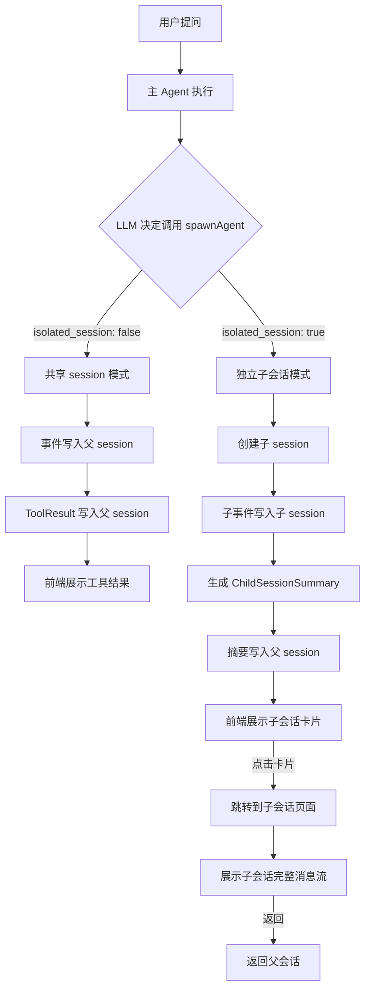

# 混合子会话架构设计

## 概要

当前子 agent 实现是"受控子回合"（Controlled Sub-Turns），所有事件写入同一个 session，通过 `AgentEventContext` 标记亲缘关系。

本方案提出**混合模式**：
- **默认共享 session** — 保持当前的简单关联模型
- **可选独立子会话** — 子 agent 拥有自己的 session_id，通过已有 `parent_session_id` 机制关联

---

## 现有基础（可直接复用）

### 1. SessionMeta 已支持分叉

```rust
// crates/core/src/event/mod.rs
pub struct SessionMeta {
    pub session_id: String,
    pub parent_session_id: Option<String>,  // ✅ 已有
    pub parent_storage_seq: Option<u64>,    // ✅ 已有
    // ...
}
```

**说明：** `SessionStart` 事件已经携带 `parent_session_id` 字段，只需在创建子 session 时使用。

### 2. AgentEventContext 已关联亲缘

```rust
// crates/core/src/agent/mod.rs
pub struct AgentEventContext {
    pub agent_id: Option<String>,          // ✅ 已有
    pub parent_turn_id: Option<String>,    // ✅ 已有
    pub agent_profile: Option<String>,     // ✅ 已有
}
```

### 3. FileSystemSessionRepository 已支持多 session

```
~/.astrcode/projects/<hash>/sessions/
  └─ <parent_session_id>/
      └── session-<id>.jsonl
  └─ <child_session_id>/       // ✅ 目录结构已支持
      └── session-<id>.jsonl
```

### 4. AgentControl 已管理亲缘树

```rust
// crates/runtime-agent-control/src/lib.rs
struct AgentEntry {
    handle: SubAgentHandle,          // 包含 session_id
    parent_agent_id: Option<String>,
    children: BTreeSet<String>,
    // ...
}
```

---

## 设计方案

### 核心思路

```
spawnAgent 工具参数增加一个可选字段：

pub struct SpawnAgentParams {
    pub r#type: Option<String>,
    pub description: String,
    pub prompt: String,
    pub context: Option<String>,
    
    // === 新增 ===
    /// 是否创建独立子会话（默认 false，共享父 session）
    #[serde(default)]
    pub isolated_session: bool,
}
```

| 模式 | `isolated_session` | 行为 |
|------|-------------------|------|
| 共享 session（默认） | `false` | 当前行为不变，事件写入同一 session，通过 `AgentEventContext` 关联 |
| 独立子会话 | `true` | 创建新的 session_id，事件写入子 session，通过 `parent_session_id` 关联 |

---

## 详细设计

### 1. 数据模型变更

#### 1.1 SpawnAgentParams 扩展

```rust
// crates/runtime-agent-tool/src/lib.rs
#[derive(Debug, Clone, Serialize, Deserialize)]
pub struct SpawnAgentParams {
    /// Agent profile ID；为空默认 `explore`
    pub r#type: Option<String>,
    /// 短摘要，仅用于 UI / 日志 / 标题
    pub description: String,
    /// 子 Agent 实际收到的任务正文
    pub prompt: String,
    /// Additional context
    pub context: Option<String>,
    /// 是否创建独立子会话（默认 false，共享父 session）
    #[serde(default)]
    pub isolated_session: bool,
}
```

#### 1.2 SubAgentHandle 扩展

```rust
// crates/core/src/agent/mod.rs
pub struct SubAgentHandle {
    pub agent_id: String,
    pub session_id: String,          // ✅ 已有：共享时等于父 session_id
    pub parent_agent_id: Option<String>,
    pub parent_turn_id: Option<String>,
    pub depth: usize,
    pub status: AgentStatus,
    pub created_at: DateTime<Utc>,
    pub agent_profile: String,
    
    // === 新增 ===
    /// 子会话的独立 session_id（仅 isolated_session=true 时设置）
    pub child_session_id: Option<String>,
}
```

#### 1.3 AgentEventContext 扩展

```rust
// crates/core/src/agent/mod.rs
pub struct AgentEventContext {
    pub agent_id: Option<String>,
    pub parent_turn_id: Option<String>,
    pub agent_profile: Option<String>,
    
    // === 新增 ===
    /// 独立子会话 ID（仅 isolated_session=true 时设置）
    pub child_session_id: Option<String>,
}
```

#### 1.4 子会话摘要事件（新增）

```rust
// crates/core/src/event/types.rs
/// 子会话完成摘要（写入父 session）
pub struct ChildSessionSummary {
    /// 对应的父 turn_id
    pub parent_turn_id: String,
    /// 子会话 ID
    pub child_session_id: String,
    /// 子会话执行结果摘要（LLM 生成或系统生成）
    pub summary: String,
    /// 子会话执行步数
    pub steps_executed: u32,
    /// 子会话执行耗时（毫秒）
    pub duration_ms: u64,
    /// 子会话终止原因
    pub outcome: ChildSessionOutcome,
}

pub enum ChildSessionOutcome {
    Completed,
    Aborted,
    TokenExceeded,
    Failed,
}
```

**序列化后的 JSON 格式：**

```json
{
  "type": "ChildSessionSummary",
  "parent_turn_id": "turn-5",
  "child_session_id": "2025-12-31T20-53-00-abc12345",
  "summary": "共执行 5 步，探索了 3 个文件，发现 UserTrait 在 3 处被引用。",
  "steps_executed": 5,
  "duration_ms": 12000,
  "outcome": "Completed"
}
```

---

### 2. 执行流程变更

#### 2.1 共享 session 模式（默认，当前行为不变）

```
launch_subagent(params, ctx)
    ↓
child = agent_control.spawn(profile, ctx.session_id, parent_turn_id, ...)
    ↓
// ✅ 使用父 session 的 event_sink
event_sink = ctx.event_sink()
    ↓
child_loop.run_turn_with_agent_context(event_sink, ...)
    ↓
// ✅ 所有事件写入同一 session
//    通过 AgentEventContext(agent_id, parent_turn_id) 标记归属
events → parent session JSONL
```

#### 2.2 独立子会话模式（新增）

```
launch_subagent(params, ctx)
    ↓
// 1️⃣ 创建子 session
child_session_id = generate_session_id()
meta = SessionMeta {
    session_id: child_session_id.clone(),
    parent_session_id: Some(ctx.session_id().to_string()),  // ✅ 关联父 session
    parent_storage_seq: None,  // 子会话不复制历史
    working_dir: ctx.working_dir.clone(),
    // ...
}
    ↓
// 2️⃣ 触发 SessionStart 事件（写入父 session）
parent_event_sink.emit(StorageEvent::SessionStart {
    session_id: child_session_id.clone(),
    parent_session_id: Some(ctx.session_id().to_string()),
    parent_storage_seq: None,
})
    ↓
// 3️⃣ 创建子 session 的事件日志写入器
child_log = repository.create_event_log(&child_session_id, working_dir)?
child_event_sink = EventSink::new(child_log)
    ↓
// 4️⃣ 创建子 agent 控制面
child = agent_control.spawn(profile, child_session_id.clone(), parent_turn_id, ...)
    ↓
// 5️⃣ 执行子 agent loop（使用子 session 的 event_sink）
child_loop.run_turn_with_agent_context(child_event_sink, ...)
    ↓
// 6️⃣ 子会话执行完成，生成摘要
summary = generate_summary(child_session_id, child.outcome, ...)
    ↓
// 7️⃣ 将摘要写回父 session
parent_event_sink.emit(StorageEvent::ChildSessionSummary {
    parent_turn_id,
    child_session_id: child_session_id.clone(),
    summary,
    steps_executed,
    duration_ms,
    outcome,
})
    ↓
// 8️⃣ 父 session 也写入一个 ToolResult（标记子会话已关联）
parent_event_sink.emit(StorageEvent::ToolResult {
    turn_id: parent_turn_id,
    // ...
    child_session_id: Some(child_session_id),  // ✅ 关联标记
})
```

---

### 3. 代码变更清单

#### 3.1 Protocol 层（纯 DTO，无业务依赖）

**文件：** `crates/protocol/src/tools/run_agent.rs`

- [ ] `SpawnAgentParams` 增加 `isolated_session: bool` 字段

#### 3.2 Core 层（核心契约）

**文件：** `crates/core/src/agent/mod.rs`

- [ ] `SubAgentHandle` 增加 `child_session_id: Option<String>`
- [ ] `AgentEventContext` 增加 `child_session_id: Option<String>`

**文件：** `crates/core/src/event/types.rs`

- [ ] 新增 `ChildSessionSummary` 事件类型
- [ ] 新增 `ChildSessionOutcome` 枚举

#### 3.3 Runtime 层（执行引擎）

**文件：** `crates/runtime/src/service/execution/subagent.rs`

- [ ] `launch_subagent()` 分支逻辑：
  - 如果 `params.isolated_session == false`：**保持当前逻辑不变**
  - 如果 `params.isolated_session == true`：
    1. 调用 `repository.create_event_log()` 创建子 session
    2. 创建独立的 `EventSink`
    3. 传递子 session 的 event_sink 给子 agent loop
    4. 子会话完成后生成 `ChildSessionSummary` 写入父 session

**关键代码结构（伪代码）：**

```rust
pub async fn launch_subagent(
    &self,
    params: SpawnAgentParams,
    ctx: &ToolContext,
) -> ServiceResult<SubRunResult> {
    // ... 现有验证逻辑不变 ...
    
    if params.isolated_session {
        // === 独立子会话模式 ===
        self.launch_subagent_isolated(params, ctx).await
    } else {
        // === 共享 session 模式（当前逻辑） ===
        self.launch_subagent_shared(params, ctx).await
    }
}

async fn launch_subagent_isolated(
    &self,
    params: SpawnAgentParams,
    ctx: &ToolContext,
) -> ServiceResult<SubRunResult> {
    let start = Instant::now();
    let parent_session_id = ctx.session_id();
    
    // 1. 创建子 session
    let child_session_id = generate_session_id();
    let meta = SessionMeta {
        session_id: child_session_id.clone(),
        parent_session_id: Some(parent_session_id.to_string()),
        parent_storage_seq: None,
        working_dir: ctx.working_dir.clone(),
        // ...
    };
    
    // 2. 写入 SessionStart 到父 session
    if let Some(sink) = ctx.event_sink() {
        sink.emit(StorageEvent::SessionStart {
            session_id: child_session_id.clone(),
            parent_session_id: Some(parent_session_id.to_string()),
            parent_storage_seq: None,
        });
    }
    
    // 3. 创建子 session 的事件日志
    let repository = self.repository.lock().await;
    let child_log = repository.create_event_log(
        &child_session_id,
        Path::new(&ctx.working_dir),
    )?;
    let child_sink = Arc::new(EventSink::new(child_log));
    
    // 4. Spawn 子 agent（使用子 session_id）
    let child = self.agent_control.spawn(
        &profile,
        child_session_id.clone(),  // ✅ 独立的 session_id
        Some(parent_turn_id.to_string()),
        ctx.agent_context().agent_id.clone(),
    ).await?;
    
    // 5. 执行子 agent loop（使用子 sink）
    let child_turn_id = format!("{}-child-{}", parent_turn_id, Uuid::new_v4());
    // ... 构建子 agent loop ...
    
    let child_loop = AgentLoop::new(...);
    let outcome = child_loop.run_turn_with_agent_context(
        child_sink.clone(),  // ✅ 独立的 event sink
        // ...
    ).await;
    
    let duration = start.elapsed();
    let steps = child_loop.step_count();
    
    // 6. 生成摘要
    let summary = self.generate_child_summary(
        &child_session_id,
        &outcome,
        steps,
        duration,
    ).await?;
    
    // 7. 将摘要写回父 session
    if let Some(sink) = ctx.event_sink() {
        sink.emit(StorageEvent::ChildSessionSummary {
            parent_turn_id: parent_turn_id.to_string(),
            child_session_id: child_session_id.clone(),
            summary: summary.clone(),
            steps_executed: steps,
            duration_ms: duration.as_millis() as u64,
            outcome: map_outcome(&outcome),
        });
    }
    
    // 8. 标记子 agent 完成
    self.agent_control.complete(&child.agent_id, &outcome).await;
    
    // 9. 返回结果（摘要 + 子 session_id）
    Ok(SubRunResult {
        status: map_outcome(&outcome),
        handoff: Some(SubRunHandoff {
            summary,
            findings: Vec::new(),
            artifacts: vec![ArtifactRef {
                kind: "session".to_string(),
                id: child_session_id.clone(),
                label: "Child session".to_string(),
                session_id: Some(child_session_id),
                storage_seq: None,
                uri: None,
            }],
        }),
        failure: None,
    })
}
```

#### 3.4 Storage 层（文件存储）

**文件：** `crates/storage/src/session/repository.rs`

- [ ] `FileSystemSessionRepository::create_event_log()` 已可用 ✅
- [ ] 可能需要增加 `list_child_sessions(parent_session_id)` 方法

```rust
impl FileSystemSessionRepository {
    // ... 现有方法不变 ...
    
    /// 列出父会话的所有子会话
    pub fn list_child_sessions(&self, parent_session_id: &str) 
        -> StoreResult<Vec<SessionMeta>> 
    {
        // 扫描 sessions 目录，过滤 parent_session_id 匹配的
    }
}
```

#### 3.5 Server 层（API 端点）

**文件：** `crates/server/src/routes/sessions.rs`

- [ ] 新增 `GET /api/sessions/{parent_id}/child_sessions` 端点

```rust
// 获取子会话列表
async fn list_child_sessions(
    Path(parent_session_id): Path<String>,
    State(state): State<AppState>,
) -> Result<Json<Vec<SessionMeta>>> {
    let children = state.repository.list_child_sessions(&parent_session_id)?;
    Ok(Json(children))
}
```

- [ ] 新增 `GET /api/sessions/{child_id}` 端点获取子会话详情

```rust
// 获取子会话详情（含父会话信息）
async fn get_child_session(
    Path(child_session_id): Path<String>,
    State(state): State<AppState>,
) -> Result<Json<SessionDetail>> {
    let session = state.repository.get_session(&child_session_id)?;
    Ok(Json(session))
}
```

#### 3.6 前端层（展示逻辑）

**文件：** `frontend/`

前端需要展示两种模式：

**共享 session 模式** — 当前展示逻辑不变

**独立子会话模式** — 新增展示组件：

```tsx
// 子会话卡片组件
<ChildSessionCard
  sessionId={child_session_id}
  summary={summary}
  steps={steps_executed}
  duration={duration_ms}
  outcome={outcome}
  onExpand={() => navigate(`/sessions/${child_session_id}`)}  // 点击跳转到子会话详情
/>
```

**交互流程：**
1. 父会话消息中出现 `ChildSessionSummary` 事件 → 渲染为**可点击卡片**
2. 默认折叠展示：`[子会话: explore] | 5 步 | 12 秒 | ✅ 完成`
3. 点击卡片 → 跳转到 `/sessions/{child_session_id}` → 展示完整的子会话消息流
4. 子会话页面可"返回父会话"

---

### 4. 数据持久化示例

#### 4.1 父 session 的 JSONL

```
session-2025-12-31T20-50-00-abc12345.jsonl:

{"storage_seq":1,"type":"SessionStart","session_id":"2025-12-31T20-50-00-abc12345"}
{"storage_seq":2,"type":"UserMessage","turn_id":"turn-5","content":"重构这个模块"}
{"storage_seq":3,"type":"AssistantFinal","turn_id":"turn-5","content":"让我先用 explore 分析..."}
{"storage_seq":4,"type":"ToolCall","turn_id":"turn-5","tool_name":"spawnAgent","args":{"type":"explore","description":"查找 UserTrait 使用","prompt":"查找 UserTrait 的使用","isolated_session":true}}
{"storage_seq":5,"type":"SessionStart","session_id":"2025-12-31T20-53-00-def67890","parent_session_id":"2025-12-31T20-50-00-abc12345"}  ← 子会话创建
{"storage_seq":6,"type":"ChildSessionSummary","parent_turn_id":"turn-5","child_session_id":"2025-12-31T20-53-00-def67890","summary":"发现 3 处使用","steps_executed":5,"duration_ms":12000,"outcome":"Completed"}
{"storage_seq":7,"type":"ToolResult","turn_id":"turn-5","tool_name":"spawnAgent","output":"[子会话摘要] 发现 3 处...","child_session_id":"2025-12-31T20-53-00-def67890"}
{"storage_seq":8,"type":"AssistantFinal","turn_id":"turn-5","content":"基于 explore 结果，我看到 3 处..."}
```

#### 4.2 子 session 的 JSONL（独立存储）

```
session-2025-12-31T20-53-00-def67890.jsonl:

{"storage_seq":1,"type":"SessionStart","session_id":"2025-12-31T20-53-00-def67890","parent_session_id":"2025-12-31T20-50-00-abc12345","parent_storage_seq":null}
{"storage_seq":2,"type":"UserMessage","turn_id":"turn-1","content":"查找 UserTrait 的使用"}
{"storage_seq":3,"type":"AssistantDelta","turn_id":"turn-1","token":"让我"}
{"storage_seq":4,"type":"AssistantDelta","turn_id":"turn-1","token":"先探索"}
{"storage_seq":5,"type":"ToolCall","turn_id":"turn-1","tool_name":"grep","args":{"pattern":"UserTrait"}}
{"storage_seq":6,"type":"ToolResult","turn_id":"turn-1","tool_name":"grep","output":"Found 3 matches..."}
{"storage_seq":7,"type":"AssistantFinal","turn_id":"turn-1","content":"我在以下文件发现 UserTrait..."}
```

---

### 5. 配置与默认行为

#### 5.1 Profile 级别配置

```yaml
# ~/.astrcode/agents/explore.yaml
id: explore
name: 代码探索
mode: SubAgent
allowed_tools:
  - read_file
  - grep
  - semantic_search
max_steps: 5

# === 新增：默认是否使用独立子会话 ===
default_isolated_session: false  # 默认共享（保持当前行为）
```

#### 5.2 覆盖方式

**优先级：**
1. `spawnAgent` 工具显式传入 `isolated_session: true/false` → **最高优先级**
2. Profile 的 `default_isolated_session` 配置 → **次优先级**
3. 全局运行时默认值（false） → **最低优先级**

```rust
let use_isolated = params.isolated_session
    || (params.isolated_session.is_none() && profile.default_isolated_session == Some(true));
```

---

### 6. 前端交互流程图



---

### 7. 向后兼容性

| 场景 | 处理 |
|------|------|
| 现有调用不传 `isolated_session` | 默认 `false`，共享 session（**行为不变**） |
| 旧版本前端加载新格式的 `ChildSessionSummary` | 忽略新字段，展示原始 `ToolResult` |
| 旧版 `AgentEventContext` 加载到新代码 | `child_session_id` 为 `None`，走共享路径 |

**迁移路径：**
- 默认行为完全不变，现有功能零影响
- 仅在显式传入 `isolated_session: true` 时触发新行为

---

### 8. 实施阶段

#### Phase 1：核心数据结构（Protocol + Core）
- [ ] `SpawnAgentParams` + `SubAgentHandle` + `AgentEventContext` 扩展
- [ ] 新增 `ChildSessionSummary` 事件
- **验证：** 编译通过，现有测试全部通过

#### Phase 2：执行引擎（Runtime）
- [ ] `launch_subagent_isolated()` 实现
- [ ] 子 session 创建与 event sink 管理
- [ ] 摘要生成与写回逻辑
- **验证：** 单元测试覆盖两种模式

#### Phase 3：存储层（Storage）
- [ ] `list_child_sessions()` 方法
- [ ] 子 session 事件查询
- **验证：** 集成测试验证文件读写

#### Phase 4：Server API
- [ ] `GET /sessions/{parent_id}/child_sessions` 端点
- [ ] 子 session 事件查询端点
- **验证：** curl 测试 API 返回正确

#### Phase 5：前端
- [ ] 子会话卡片组件
- [ ] 子会话页面路由
- [ ] 父子会话切换
- **验证：** 手动测试 UI 交互

---

### 9. 风险与缓解

| 风险 | 影响 | 缓解 |
|------|------|------|
| 子 session 文件未正确创建 | 数据不一致 | 在 `launch_subagent_isolated()` 中增加 try-finally 回滚 |
| 并发写入父子 session | 事件顺序混乱 | 使用文件锁（已有机制）|
| 子 session 泄漏（创建后未清理） | 磁盘空间浪费 | 增加定时清理任务，清理孤儿 session |
| 前端渲染性能（大量子会话） | 页面卡顿 | 虚拟滚动 + 懒加载子会话卡片 |

---

### 10. 使用示例

#### 示例 1：默认共享 session（当前行为不变）

```json
{
  "type": "explore",
  "description": "查找 UserTrait 使用",
  "prompt": "查找所有使用 UserTrait 的地方",
  "isolated_session": false
}
```

父 session JSONL 中包含子 agent 的所有事件：
```
Turn 5: UserMessage("重构这个模块")
  → ToolCall("spawnAgent", {type: "explore", prompt: "...", ...})
    → ToolCall("read_file", ...) [agent_id=agent-1, parent_turn_id=turn-5]
    → ToolResult("read_file", ...) [agent_id=agent-1, parent_turn_id=turn-5]
  → ToolResult("spawnAgent", output="[摘要] 发现 3 处...")
  → AssistantFinal("基于 explore 结果...")
```

#### 示例 2：独立子会话（新功能）

```json
{
  "type": "explore",
  "description": "查找 UserTrait 使用",
  "prompt": "查找所有使用 UserTrait 的地方",
  "isolated_session": true
}
```

父 session JSONL：
```
Turn 5: UserMessage("重构这个模块")
  → ToolCall("spawnAgent", {type: "explore", prompt: "...", isolated_session: true})
    → SessionStart(session_id="child-abc", parent_session_id="parent-xyz") ← 标记子会话创建
    → ChildSessionSummary(child_session_id="child-abc", summary="发现 3 处使用")
  → ToolResult("spawnAgent", output="[子会话摘要] 发现 3 处...", child_session_id="child-abc")
  → AssistantFinal("基于 explore 结果...")
```

子 session JSONL（独立文件）：
```
SessionStart(session_id="child-abc", parent_session_id="parent-xyz")
Turn 1: UserMessage("查找所有使用 UserTrait 的地方")
  → AssistantDelta("让我先探索...")
  → ToolCall("read_file", ...)
  → ToolResult("read_file", ...)
  → AssistantFinal("发现 3 处使用...")
```

前端展示：

```
┌─────────────────────────────────────────────┐
│ 父会话                                       │
│                                              │
│ 用户：重构这个模块                            │
│                                              │
│ 助手：让我先用 explore 分析...                │
│  🔧 spawnAgent("explore", "查找 UserTrait...") │
│  ┌───────────────────────────────────────┐   │
│  │ 🔍 [子会话: explore]                  │   │
│  │ 5 步 | 12 秒 | ✅ 完成                │   │
│  │ 摘要：发现 3 处使用...                │   │
│  │ ▶ 点击查看完整子会话                   │   │  ← 点击跳转到子会话页面
│  └───────────────────────────────────────┘   │
│                                              │
│ 助手：基于 explore 结果，我看到 3 处...      │
└─────────────────────────────────────────────┘
```

---

### 11. 关键决策记录

| 决策 | 选择 | 原因 |
|------|------|------|
| 默认行为 | 共享 session（false） | 向后兼容，保持当前行为 |
| 子会话触发方式 | 参数传入 | 由 LLM 或调用者动态决定 |
| 子事件存储位置 | 独立文件 | 隔离性，方便单独查询/回放 |
| 父子关联方式 | `parent_session_id` + `ChildSessionSummary` | 复用已有机制，最小侵入 |
| 摘要生成方式 | 系统自动生成（步数+结果摘要） | 减少 LLM 调用开销 |

---

### 12. 相关文档

- [当前设计文档](../design/agent-tool-and-api-design.md) — 第 4 节"Agent as Tool"
- [Agent Loop 内容架构](./agent-loop-content-architecture.md) — Session/Message 数据模型
- [ADR-0005](../adr/0005-split-policy-decision-plane-from-event-observation-plane.md) — 事件观察面设计
- [ADR-0006](../adr/0006-turn-outcome-state-machine.md) — Turn 状态机
