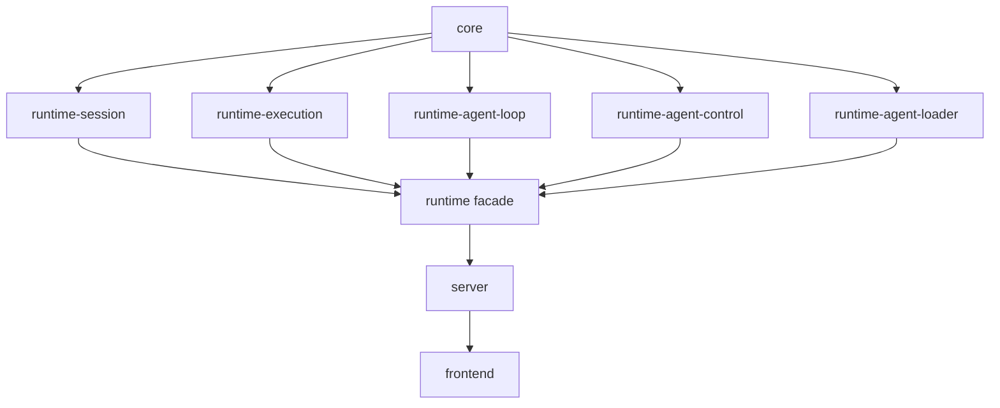

# Design: Execution Boundary Refactor

## Goal

把五个核心边界的 owner、依赖方向、公共 surface 与待删除 surface 一次说清楚，避免“边界拆开后又重拆”。

本文不重复描述 subrun 协议字段；协议字段见 `design-subrun-protocol.md`。

## End-State Boundaries

| Boundary | Single owner responsibility | Public surface after refactor | Must not own |
|----------|-----------------------------|-------------------------------|--------------|
| `runtime-session` | session 真相、turn ledger、durable replay、compaction、session catalog | `sessions()` handle：`create`、`list`、`history`、`replay`、`delete_session`、`delete_project`、`compact`、`subscribe_catalog` | agent loop、live subrun registry、working-dir resolver、root execute orchestration |
| `runtime-execution` | root/subrun 执行编排、submit/interrupt、subrun status/cancel、working-dir execution context | `execution()` handle：`submit_prompt`、`interrupt_session`、`execute_root_agent`、`launch_subagent`、`get_subrun_status`、`cancel_subrun` | durable log storage、SSE projection、UI read model |
| `runtime-agent-loop` | 单次 LLM/tool 主循环 | `TurnRunner` trait implementation | session id 管理、历史 replay、live subrun tree |
| `runtime-agent-control` | live subrun registry、cancel、depth/concurrency limit、running handle | `LiveSubRunControl` trait implementation | durable 历史解析、scope 过滤、working-dir resolver |
| `runtime` façade | 组装、生命周期管理、hot reload / resolver 注入、向 server 暴露唯一入口 | `RuntimeService::sessions()`、`RuntimeService::execution()`、`RuntimeService::tools()` | 第二套实现层、重复 façade、fallback 业务逻辑 |

## Compile-Time Dependency Direction

### Rule

`runtime-*` 子 crate 在编译期并列，公共协作契约上提到 `core`；`runtime` 门面负责注入实现。

### Consequences

1. `runtime-execution` 不直接依赖 `runtime-session` crate。
2. `runtime-session` 不直接依赖 `runtime-agent-loop` 或 `runtime-agent-control` crate。
3. `runtime` 门面必须把 session boundary、execution boundary、loop runner、live control、agent resolver 注入到一起。

## Runtime Call Direction

### Root prompt / root agent execute

1. `server` 调 `runtime.execution()`
2. `runtime-execution` 解析 `ExecutionResolutionContext`
3. `runtime-execution` 调 session boundary 获取/创建 turn ledger
4. `runtime-execution` 调 live control 注册 running handle
5. `runtime-execution` 调 loop runner 跑单次循环
6. `runtime-session` 负责 durable append / replay 真相

### Subrun status

1. `runtime-execution` 先问 live control 是否仍在运行
2. 再用 durable lifecycle event 构建 lineage/status
3. 返回统一的 status shape，source 显式区分 `live` / `durable` / `legacyDurable`

## Supporting Adapter: WorkingDirAgentResolver

`runtime-agent-loader` 继续做纯 loader；working-dir 解析与 watch 缓存在 `runtime` 装配层提供 `WorkingDirAgentResolver`。

**为什么不把它放进 `runtime-agent-loader`**

- loader 负责“怎么读文件”
- resolver 负责“这次 execution 应该绑定哪份快照”
- watch/caching 属于 runtime 生命周期管理，不属于 loader 文件解析本身

## Public Surface Mapping

| Current surface | Current owner | End-state owner |
|----------------|--------------|-----------------|
| `RuntimeService::load_session_history()` | `session_service.rs` façade | `runtime.sessions().history()` |
| `RuntimeService::replay()` | `execution_service.rs` façade | `runtime.sessions().replay()` |
| `RuntimeService::submit_prompt()` | `execution_service.rs` façade | `runtime.execution().submit_prompt()` |
| `RuntimeService::interrupt()` | `execution_service.rs` façade | `runtime.execution().interrupt_session()` |
| `RuntimeService::agent_execution_service()` | `service/execution/*` handle | `runtime.execution()` |
| `RuntimeService::tool_execution_service()` | `service/execution/*` handle | `runtime.tools()` |

目前代码状态已经与上表对齐：

- server 的 session / stream / mutation / agents / tools 路由都改为 `sessions()` / `execution()` / `tools()`
- `DeferredSubAgentExecutor` 与 `RuntimeGovernance` 也直接走 `execution()`
- `session_service.rs`、`execution_service.rs`、`replay.rs`、`turn/submit.rs`、`session/load.rs` 已删除

## File Ownership Changes

### `runtime-session`

**Keeps**

- session create/load/delete/list
- durable event append/replay
- compaction / recent tail / active turn lease

**Loses**

- `AgentControl` 直接调用
- `AgentLoop` 直接依赖
- `run_session_turn` 这种把“记真相”和“跑主循环”揉在一起的执行入口

### `runtime-execution`

**Keeps / Gains**

- root agent execute
- submit prompt / interrupt
- subrun launch
- subrun status / cancel
- durable-first query strategy
- working-dir execution context

**Must not gain**

- durable file IO
- SSE route/filter 逻辑
- frontend tree/read model

### `runtime` façade

**Keeps**

- dependency injection
- lifecycle bootstrap
- resolver/watch wiring

**Loses**

- `session_service.rs`
- `execution_service.rs`
- “旧 façade 调新 façade，再回调到旧 façade”的转发链

## Deletion Targets

迁移完成后必须删除或收缩为零逻辑转发的文件：

- `crates/runtime/src/service/session_service.rs`
- `crates/runtime/src/service/execution_service.rs`
- `crates/runtime/src/service/replay.rs`
- `crates/runtime/src/service/turn/submit.rs`
- `crates/runtime/src/service/session/load.rs` 中仅剩 façade 转发的方法

## Implementation Checklist

- [x] 五个 boundary 的 owner / public surface / must-not-own 约束已显式化。
- [x] compile-time 依赖方向与仓库 crate 分层规则保持单向。
- [x] caller 迁移目标面已与 `migration.md` 中删除顺序对齐。
- [x] 待删除文件清单与 `tasks.md`（T022-T028）保持一致。

## Boundary Acceptance Criteria

一个 boundary 只有在同时满足下列条件后，才算真正收敛：

1. 对外 surface 只剩一个 owner。
2. compile-time 依赖方向符合上面的图。
3. 不再需要通过上游 façade 回调自己拥有的职责。
4. server 与 frontend 的调用点能直接指出唯一 owner，而不是“先走 façade 再看内部委托”。
